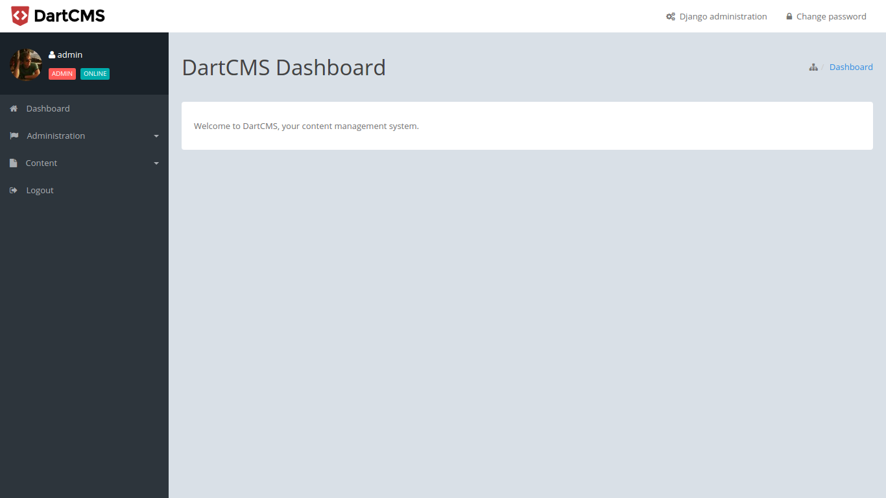

Quickstart
==========

I'm assuming that you've already setup your Django project, including database.
So, please follow next instructions to run DartCMS panel:

1. Install DartCMS with `pip`:

.. code-block:: bash

    pip install dartcms

2. Go to your project's `settings.py` file and import DartCMS apps:

.. code-block:: python

    from dartcms import get_dartcms_core_apps

    ...

    INSTALLED_APPS = [
        'django.contrib.admin',
        'django.contrib.auth',
        'django.contrib.contenttypes',
        'django.contrib.sessions',
        'django.contrib.messages',
        'django.contrib.staticfiles',
        ...
    ] + get_dartcms_core_apps()

Also, you can pass optional parameter named `include_apps` to define which apps you want to include from `dartcms`.

.. code-block:: python

    INSTALLED_APPS = [
        ...
    ] + get_dartcms_core_apps(include_apps=['shop'])

In this example, you will include only `dartcms.apps.shop` application in your project.

3. Add DartCMS's context processor to your templates settings:

.. code-block:: python

    TEMPLATES = [
        {
            ...
            'OPTIONS': {
                'context_processors': [
                    ...
                    'dartcms.context_processors.modules_data'
                ]
            }
        }
    ]

4. Include Django admin and DartCMS urls in your `urlconf`:

.. code-block:: python

    urlpatterns = [
        url(r'^admin/', admin.site.urls),
        url(r'^cms/', include('dartcms.urls', namespace='dartcms')),
    ]

You can choose any url name for DartCMS urls import.

5. Run django migrations:

.. code-block:: bash

    python manage.py migrate

6. Run development server and navigate your browser to http://127.0.0.1:8000/cms/. You should see DartCMS dashboard.

